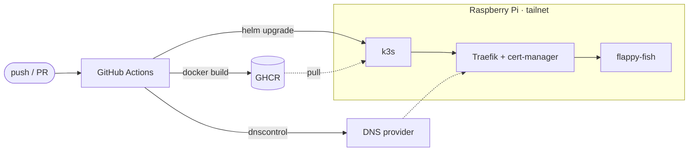

# flappy-fish

Flappy Bird, but a fish. SvelteKit + canvas, served from a Raspberry Pi at
[flappy-fish.k8s.signed.zone](https://flappy-fish.k8s.signed.zone).

```bash
npm install
npm run dev
```

## Pipeline



Every PR gets its own namespace and hostname,
`flappy-fish-pr-<n>.k8s.signed.zone`, removed when the PR closes.

Cluster setup: [deploy/README.md](deploy/README.md) · chart: [flappy-fish/](flappy-fish/) · DNS: [dnscontrol/](dnscontrol/)

# Statement on usage of AI

LLMs were only used in this project as a search engine, as well as to generate the code for the game. The game itself is not the interesting part here for this course. The DevOps stuff, that is relevant to the course (Automated Software Testing and DevOps - DD2482), was written by us, the authors.

# Authors

- Vilhelm Prytz vilhelm@prytznet.se / vprytz@kth.se
- Filip Dimitrijevic filipdi@kth.se
